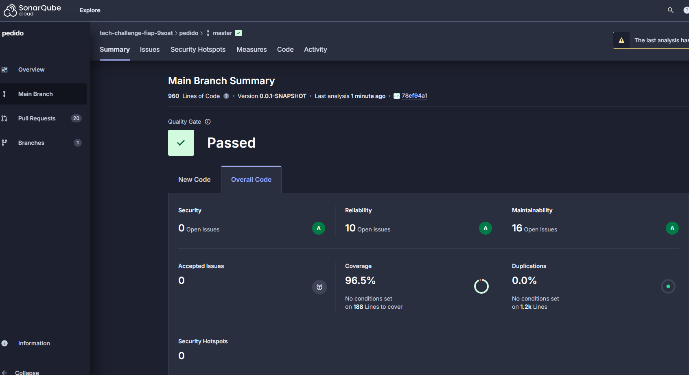
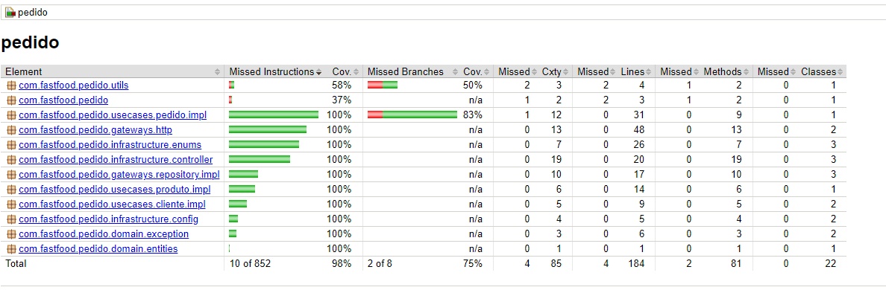

# tech-challenge-fastfood-pedido

## Visão Geral
Este repositório é responsavel pelos processos de pedido, cliente e produto de um fastfood para o **Tech Challenge** FIAP

## Funcionalidades do Sistema

### Pedidos
- **Cadastro de Cliente**: O cliente pode se identificar via CPF, se cadastrar com nome e e-mail, ou fazer o pedido anonimamente.
- **Montagem de Combos**: O cliente pode montar seu pedido seguindo uma sequência opcional:
    - Lanche
    - Acompanhamento
    - Bebida
    - Sobremesa
- **Exibição de Produtos**: Em cada etapa, são exibidos o nome, a descrição e o preço dos produtos disponíveis.

## Ambiente de Desenvolvimento

- **Java 21**
- **Docker / Kubernetes**
- **Maven**: Apache Maven 3.9.9
- **Banco de Dados**: PostgreSQL 17
    - Username: `postgres`
    - Password: `1234`
---

## Cobertura de testes




# Passo a passo para execução

1. Após realizar o clone do projeto deve-se primeiro se atentar as versões do java e do maven suportadas pelo projeto de acordo com o tópico **Ambiente de Desenvolvimento** acima;
2. Posteriormente, basta rodar a seguinte sequência de scripts que seguem abaixo concatenados:
```shell
 kubectl apply -f k8s-infra/env/secret.yaml &
 kubectl apply -f k8s-infra/env/configmap.yaml &
 kubectl apply -f k8s-infra/db/postgresdb-statefulset.yaml &
 kubectl apply -f k8s-infra/db/postgresdb-service.yaml &
 kubectl apply -f k8s-infra/fastfoodapi/fastfoodapi-pedido-deployment.yaml &
 kubectl apply -f k8s-infra/fastfoodapi/fastfoodapi-pedido-service.yaml & 
 kubectl apply -f k8s-infra/hpa/fastfoodapi-hpa.yaml
```
3. A aplicação estará disponível em http://localhost:30003/fastfood/swagger-ui/index.html
4. Segue abaixo ordem indicada para o uso das APIs:
    1. cliente-controller (cadastro e busca de clientes)
    2. produto-controller (cadastro, atualização, busca e deleção de produtos
    3. pedido-controller (cadastro, atualização e busca de pedidos)
    4. pagamento-controller (pagamento e verificação)
